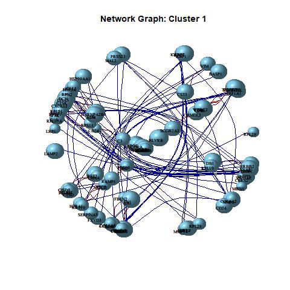
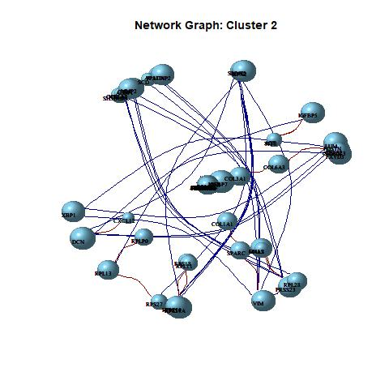

<style>
.main-container {
  max-width: 100% !important;
}
</style>

 <div class="part1">
<h1>SpaceX: Gene Co-Expression Network Estimation for
 Spatial Transcriptomics: Visualization</h1>
 
<div class="tab">
<button class="tablinks button" onclick="location.href='htmlrmark1.html'">Home</button>
<button class="tablinks button" onClick="location.href='my2.html'">Installation</button> 
<button class="tablinks button" onclick="location.href='my3.html'">Examples</button>
<button class="tablinks button" onclick="location.href='my4.html'">Visualization</button>
<button class="tablinks button" onclick="location.href='my5.html'">Supplemental File</button>
<button class="tablinks button" onclick="location.href='my6.html'">Contact</button>
<button class="tablinks button" onclick="location.href='my7.html'">Citation</button>
<button class="tablinks button" onclick="location.href='my8.html'">View on Github</button>
<button class="tablinks button" onclick="location.href='my9.html'">Acknowledgement</button>
 </div>
  </div>


 
```{r setup, include=FALSE}
knitr::opts_chunk$set(echo = TRUE)
```

```{r klippy, echo=FALSE, include=TRUE}
klippy::klippy(position=c("top","right"))
```


</img>

 

</img>

</img>


</img>


<iframe src="mynet2.html" width="100%" height="400px" data-external="1">
</iframe>


